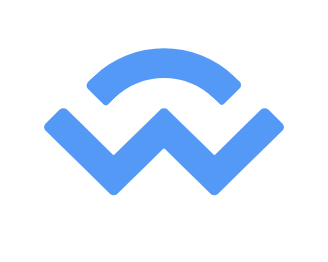

# Wallet-connect-kotlin

 

# Table of Contents

- [Introduction](#introduction)  
- [Why did I maintain a separate repo?](#why-did-i-maintain-a-separate-repo)  
- [Installation](#installation)  
- [Example App](#example-app)  
- [About the Author](#about-the-author) 

## Introduction

WalletConnect is an Open protocol for connecting Wallets to Dapps. 
There are various kotlin variants of the WalletConnect implementation which can be found on github, but the two mostly used are:-
 
- This [repo](https://github.com/WalletConnect/kotlin-walletconnect-lib) maintained by WalletConnect itself
- This [repo](https://github.com/trustwallet/wallet-connect-kotlin) maintained by Trust-wallet.
 
This version that you can find here is a fork of Trust-wallet's implementation of the WalletConnect protocol.

## Why did I maintain a separate repo?

Well, in this repo you can find support for <b>multiple Dapp connections simultaneously</b> which is not supported by any other repo and while you can find my [Pull Request](https://github.com/trustwallet/wallet-connect-kotlin/pull/16) to Trust_wallet's repository, they rejected it and as you can see from the comments on that PR itself, that the person reviewing the Pull request thought critical changes were only indentation changes.
I agree, this might not be the most efficient solution for now, but it is what it is. 
Another USP is that for every `request's callback`, we can receive the `topic` as a `callback argument` which is very crucial at times.

## Installation

  Add it in your root build.gradle at the end of repositories:

          allprojects {
            repositories {
              ...
              maven { url 'https://jitpack.io' }
            }
          }

  Add the dependency in your app module's build.gradle file
          
          dependencies {
		         ...
	          implementation "com.github.abhriyaroy:wallet-connect-kotlin:{latest_version}"
	        }
          
          
 You can connect to a session as follows :-
 
              val session = initWCSession(uri)
              clientMeta = WCPeerMeta("", "")
              val multiWcClient = MultiWCClientManager(okHttpClientProvider.getInstance())
              val listener = WCClientCallBacksListener()
              listener.onSessionRequest = ::onSessionRequest
              listener.onEthSign = ::onEthSign
              listener.onFailure = ::onFail
              listener.onEthSendTransaction = ::onEthSendTransaction
              listener.onCustomRequest = ::onCustomRequest
              listener.onDisconnect = ::onDisconnect
              multiWcClient!!.connect(session, listener, clientMeta)
              
              
              private fun onSessionRequest(topic: String, id: Long, peer: WCPeerMeta) {
                // Do something
              }

              private fun onEthSign(topic: String, id: Long, message: WCEthereumSignMessage) {
                // Do something
              }

              private fun onEthSendTransaction(topic: String, id: Long, transaction: WCEthereumTransaction) {
                // Do something
              }

              private fun onFail(topic: String, throwable: Throwable) {
                // Do something
              }

              private fun onCustomRequest(topic: String, id: Long, payload: String) {
                // Do something
              }

              private fun onDisconnect(topic: String, code: Int, reason: String) {
                // Do something
              }
              
## Example App
To experience this, you can head over to the [Matic Wallet](https://play.google.com/store/apps/details?id=network.matic.wallet&hl=en_IN) <b>beta version</b> and check it out yourself.
 

## About the Author

### Abhriya Roy

 Android Developer with 2 years of experience in building apps that look and feel great. 
 Enthusiastic towards writing clean and maintainable code.
 Open source contributor.

      &nbsp;
  
 &nbsp;
  
 &nbsp;
 
 &nbsp;
 

  
          
  
